#  Tzolkin <!-- omit in toc -->

This cross platform - Linux, Mac OS X and Windows - F# .Net library and smartphone app converts Maya Tzolk’in dates to Gregorian dates and vice versa.

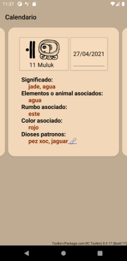
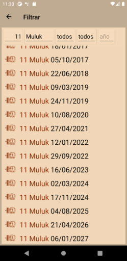

If you want to know more about the Maya calendar systems, see [Links](#links).

Information about the smart-phone app is at [Usage of the Smartphone App](#usage-of-the-smartphone-app)

A video of the smart-phone app is at [YouTube](https://www.youtube.com/watch?v=os32KCEqGCk).

To interactively try out the F# NuGet package Tzolkin, go to the Jupyter Notebook at [](https://mybinder.org/v2/gh/Release-Candidate/Tzolkin/main?filepath=Tzolkin.ipynb)

Full documentation can be found at [Read the Docs](https://tzolkin.readthedocs.io/en/latest/)


[](https://fsharp.org/)
[](https://dotnet.microsoft.com/download)
[](https://www.nuget.org/packages/Tzolkin/)
[](https://tzolkin.readthedocs.io/en/latest/)
[](https://mybinder.org/v2/gh/Release-Candidate/Tzolkin/main?filepath=Tzolkin.ipynb)
[more badges ...](#badges)

## Table of Content <!-- omit in toc -->

- [Links](#links)
- [Download](#download)
- [Installation and Usage](#installation-and-usage)
  - [Usage of the Smartphone App](#usage-of-the-smartphone-app)
  - [Tzolkin NuGet Package](#tzolkin-nuget-package)
    - [Install Package & Basic Usage](#install-package--basic-usage)
    - [Create Tzolk’in Dates](#create-tzolkin-dates)
    - [Conversion to Integers and Strings](#conversion-to-integers-and-strings)
    - [Convert Gregorian Dates to Tzolk’in Dates](#convert-gregorian-dates-to-tzolkin-dates)
    - [Find Tzolk’in Dates](#find-tzolkin-dates)
    - [Calculations with Tzolk’in Dates](#calculations-with-tzolkin-dates)
    - [Tzolk’in Year, Glyph descriptions and Unicode Glyphs](#tzolkin-year-glyph-descriptions-and-unicode-glyphs)
- [Contributing](#contributing)
- [License](#license)
- [Privacy Policy](#privacy-policy)
- [Badges](#badges)
  - [Code coverage](#code-coverage)
  - [GitHub Actions/Workflows](#github-actionsworkflows)

## Links

Smithsonian Museo Nacional del Indígena Americano: [Viviendo El Tiempo Maya](https://maya.nmai.si.edu/es)

Website of the Smithsonian National Museum of the American Indian on Mayas [Living Maya Time](https://maya.nmai.si.edu/).

Online general Maya (not only Tzolk’in) calendar converter: [Maya Converter of the Smithsonian NMAI](https://maya.nmai.si.edu/calendar/maya-calendar-converter)

[Convertidor Al Calendario Maya Smithsonian NMIA](https://maya.nmai.si.edu/es/calendario/convertidor-de-calendario-maya)

Meaning of the Tzolk’in day glyphs [Arqueología Mexicana](https://arqueologiamexicana.mx/dias-mayas)

Mayan Glyphs and Unicode: [Roadmap to the SMP](https://www.unicode.org/roadmaps/smp/) and the PDF [Updated List of Characters for Mayan Codices](https://www.unicode.org/L2/L2020/20248-mayan-update.pdf)

## Download

[Link to the latest release](https://github.com/Release-Candidate/Tzolkin/releases/latest)

List of changes: [CHANGELOG.md](https://github.com/Release-Candidate/Tzolkin/blob/main/CHANGELOG.md)

### Android

Install the package for your smart-phone (.apk for Android) onto your phone - search the web on how you can do that, this depends on your phone

### iOS

I can’t generate an iPhone package myself, so you have to build the project IOS for yourself and provision the app to your phone. Microsoft has a how-to [here](https://docs.microsoft.com/en-us/xamarin/ios/get-started/installation/device-provisioning/free-provisioning?tabs=macos)

### NuGet Package

Download an install the Tzolkin Nuget package using your IDE (Visual Studio or JetBrains Rider) or one of the command-line possibilities: [Tzolkin Package at NuGet](https://www.nuget.org/packages/Tzolkin/)

In an interactive F# FSI session, you can use the command #r "nuget: Tzolkin" to download and use the NuGet package LunaZodiaco.

## Installation and Usage

### Usage of the Smartphone App

See [YouTube video of the smart-phone app](https://www.youtube.com/watch?v=os32KCEqGCk) for a video.


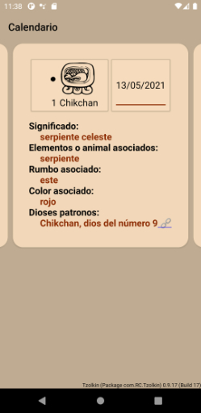

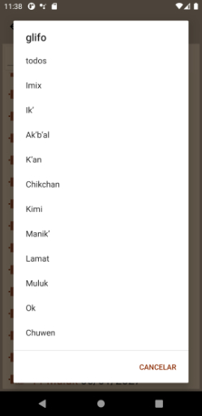
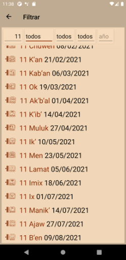
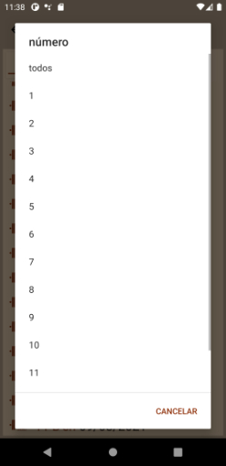
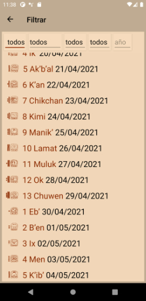
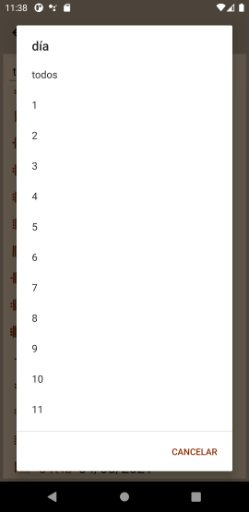
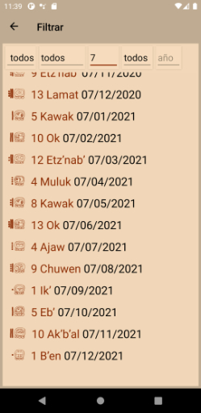
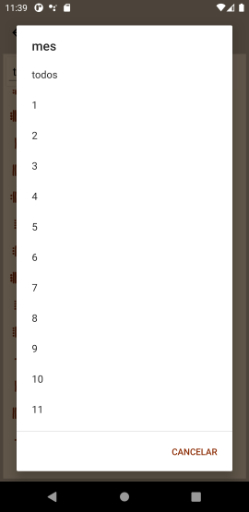
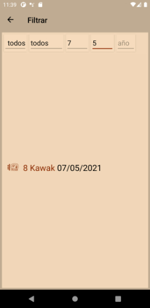
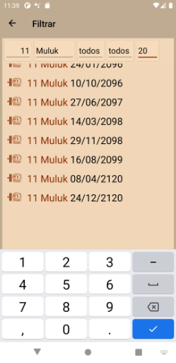
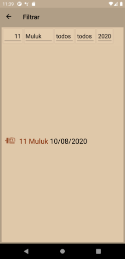
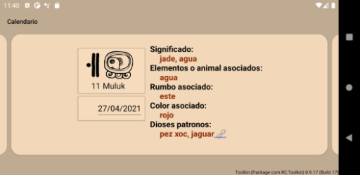
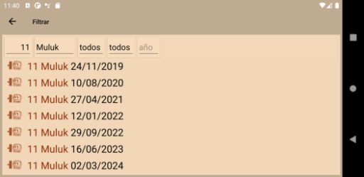

### Tzolkin NuGet Package

A F# Maya Tzolk’in date converter and calculator library.

#### Install Package & Basic Usage

Download an install the `Tzolkin` Nuget package using your IDE (Visual Studio or JetBrains Rider) or one of the command-line possibilities: [Tzolkin Package at NuGet](https://www.nuget.org/packages/Tzolkin/)

In an interactive F# FSI session, you can use the command `#r "nuget: NUGET_PACKAGE"` to download and use the nuget package `NUGET_PACKAGE`.

To use Tzolkin in this interactive session:

```F#
#r "nuget: Tzolkin"
```

```ps1con
>>  Installed package Tzolkin version 0.9.16
```

Everything is contained in the namespace `RC.Maya`, so let's open that

```F#
open RC.Maya
```

To check if everything's working, we call `TzolkinDate.today` to get todays (today is the 23th of April, 2021) Tzolk’in date - 7 Chikchan.

```F#
TzolkinDate.today
```

```ps1con
>>  Number  Glyph
>>      7   Chikchan
```

#### Create Tzolk’in Dates

A Tzolk’in date consists of a Tzolk’in day number and a Tzolk’in day glyph. A day number is a int between 1 and 13 (including 1 and 13). A day glyph is one of the 20 names "Imix", "Ikʼ", "Akʼbʼal", "Kʼan", "Chikchan", "Kimi", "Manikʼ", "Lamat", "Muluk", "Ok", "Chuwen", "Ebʼ", "Bʼen", "Ix", "Men", "Kʼibʼ", "Kabʼan", "Etzʼnabʼ", "Kawak" and "Ajaw".

A Tzolk’in day number is represented by the type `TzolkinNumber.T` with a constructor `TzolkinNumber.T.TzolkinNumber`.

```F#
let tzolkinN = TzolkinNumber.T.TzolkinNumber 5
tzolkinN
```

```ps1con
     Item
        5
```

But as only certain ints are allowed Tzolk’in day numbers, we have the constructor `TzolkinNumber.create`, that returns a `TzolkinNumber option`: `None` if the given int is non-positive (0 or negative) and values modulo 13 else, but with `13` instead of `0` if `n ≡ 0 (mod 13)`.

```F#
TzolkinNumber.create 3
```

```ps1con
    Value
        3
```

```F#
TzolkinNumber.create 56
```

```ps1con
    Value
        4
```

```F#
TzolkinNumber.create -8
```

```ps1con
    None
```

```F#
TzolkinNumber.create 26
```

```ps1con
     Value
        13
```

Same for Tzolk’in day glyphs `TzolkinGlyph`:

```F#
let tzolkinG = TzolkinGlyph.T.TzolkinGlyph 5
tzolkinG.ToString ()
```

```ps1con
    Chikchan
```

```F#
TzolkinGlyph.create 14
```

```ps1con
     Value
        Ix
```

```F#
TzolkinGlyph.create -7
```

```ps1con
    None
```

```F#
TzolkinGlyph.create 232
```

```ps1con
      Value
        Ebʼ
```

We can also construct a `TzolkinGlyph` from a string using either `TzolkinGlyph.fromString`:

```F#
TzolkinGlyph.fromString "Kabʼan"
```

```ps1con
     Value
    Kabʼan
```

```F#
TzolkinGlyph.fromString "Kab'an"
```

```ps1con
    None
```

or `TzolkinGlyph.parseString` to also allow non-exact strings.

```F#
TzolkinGlyph.parseString "Kabʼan"
```

```ps1con
     Value
    Kabʼan
```

```F#
TzolkinGlyph.parseString "Kab'an"
```

```ps1con
     Value
    Kabʼan
```

```F#
TzolkinGlyph.parseString "K-a'b++AN"
```

```ps1con
     Value
    Kabʼan
```

`TzolkinGlyph.parseString` ignores most punctuation characters, and is suitable to parse user input.

The list `TzolkinGlyph.glyphNames` contains all Tzolk’in day glyph names as string:

```F#
TzolkinGlyph.glyphNames
```

```ps1con
    index     value
        0      Imix
        1       Ikʼ
        2   Akʼbʼal
        3      Kʼan
        4  Chikchan
        5      Kimi
        6    Manikʼ
        7     Lamat
        8     Muluk
        9        Ok
        10   Chuwen
        11      Ebʼ
        12     Bʼen
        13       Ix
        14      Men
        15    Kʼibʼ
        16   Kabʼan
        17 Etzʼnabʼ
        18    Kawak
        19     Ajaw
```

A Tzolk’in day `TzolkinDate` is a record with two fields, `Number` and `Glyph`:

```F#
let tzolkin = { TzolkinDate.Number = TzolkinNumber.T.TzolkinNumber 13; TzolkinDate.Glyph = TzolkinGlyph.T.TzolkinGlyph 17 }
tzolkin
```

```ps1con
>>    Number  Glyph
>>       13  Kabʼan
```

It can be created with a `TzolkinNumber` and a `TzolkinGlyph`:

```F#
let tzolkinN = TzolkinNumber.T.TzolkinNumber 13
let tzolkinG = TzolkinGlyph.T.TzolkinGlyph 17

TzolkinDate.create tzolkinN tzolkinG
```

```ps1con
>>    Number  Glyph
>>       13  Kabʼan
```

But this does not check the input, so invalid dates can be a result.

```F#
let tzolkinN = TzolkinNumber.T.TzolkinNumber 65
let tzolkinG = TzolkinGlyph.T.TzolkinGlyph 6

TzolkinDate.create tzolkinN tzolkinG
```

```ps1con
>>    Number  Glyph
>>       65    Kimi
```

The constructor `TzolkinDate.fromInts` checks the input and returns an `TzolkinDate option`:

```F#
TzolkinDate.fromInts 13 17
```

```ps1con
        Value
    13 Kabʼan
```

```F#
TzolkinDate.fromInts -3 14
```

```ps1con
        None
```

```F#
TzolkinDate.fromInts 13 -6
```

```ps1con
        None
```

There exists two constructor to create a `TzolkinDate` from strings.

`TzolkinDate.fromStrings` creates a `TzolkinDate option` from 2 strings:

```F#
TzolkinDate.fromStrings "13" "Kabʼan"
```

```ps1con
        Value
    13 Kabʼan
```

```F#
TzolkinDate.fromStrings "-3" "Kabʼan"
```

```ps1con
        None
```

```F#
TzolkinDate.fromStrings "13" "FOO"
```

```ps1con
        None
```

`TzolkinDate.fromString` creates a `TzolkinDate` from a combined date. The day number and day glyph can be separated by whitespace, by a punctuation character or not at all:

```F#
TzolkinDate.fromString "13 Kabʼan"
```

```ps1con
        Value
    13 Kabʼan
```

```F#
TzolkinDate.fromString "13-Kabʼan"
```

```ps1con
        Value
    13 Kabʼan
```

```F#
TzolkinDate.fromString "13Kabʼan"
```

```ps1con
        Value
    13 Kabʼan
```

Both `TzolkinDate.fromString` and `TzolkinDate.fromStrings` parse the glyph name string and ignore almost all punctuation characters in it. So these functions are suitable to parse user input.

```F#
TzolkinDate.fromString "13 kA*b`aN"
```

```ps1con
        Value
    13 Kabʼan
```

```F#
TzolkinDate.fromStrings "13" "k*a-b´`^aN#"
```

```ps1con
        Value
    13 Kabʼan
```

#### Conversion to Integers and Strings

All Tzolk’in types can be converted to int and string, using `int` (only `TzolkinNumber`and `TzolkinGlyph`) or `toInt` (all 3) and either the function `toString` or the member function `ToString`:

```F#
let tzolkinG = TzolkinGlyph.T.TzolkinGlyph 17

TzolkinGlyph.toString tzolkinG
```

```ps1con
        Kabʼan
```

```F#
tzolkinG.ToString ()
```

```ps1con
        Kabʼan
```

```F#
int tzolkinG
```

```ps1con
        17
```

A `TzolkinNumber` can be converted to an int using `int`:

```F#
let tzolkinN = TzolkinNumber.T.TzolkinNumber 13

int tzolkinN
```

```ps1con
        13
```

A `TzolkinDate` can be converted to an int using `TzolkinDate.toInt`, returning the number of the day in the Tzolk’in year of 260 days:

```F#
let tzolkin = TzolkinDate.create (TzolkinNumber.T.TzolkinNumber 13) (TzolkinGlyph.T.TzolkinGlyph 17)

TzolkinDate.toInt tzolkin
```

```ps1con
    117
```

A `TzolkinDate` can be converted to a string using it's member function `ToString`:

```F#
let tzolkin = TzolkinDate.create (TzolkinNumber.T.TzolkinNumber 13) (TzolkinGlyph.T.TzolkinGlyph 17)

tzolkin.ToString ()
```

```ps1con
        13 Kabʼan
```

Or using the function `TzolkinDate.toString`:

```F#
let tzolkin = TzolkinDate.create (TzolkinNumber.T.TzolkinNumber 13) (TzolkinGlyph.T.TzolkinGlyph 17)

TzolkinDate.toString tzolkin
```

```ps1con
        13 Kabʼan
```

#### Convert Gregorian Dates to Tzolk’in Dates

We can get the Tzolk’in date of the current day using `TzolkinDate.today` (today is the 23th of April, 2021, 7 Chikchan)

```F#
TzolkinDate.today
```

```ps1con
>>    Number    Glyph
>>         7 Chikchan
```

To get the Tzolk’in date of a given Gregorian date, there are the functions `TzolkinDate.fromDate` - to convert from a `DateTime`. We use the 25th of May, 2021.

```F#
TzolkinDate.fromDate (DateTime (2021, 05, 25))
```

```ps1con
>>    Number  Glyph
>>       13  Kabʼan
```

`TzolkinDate.fromDateString` to convert from a date string given and a date format string

```F#
TzolkinDate.fromDateString "25.05.2021" "dd.MM.yyyy"
```

```ps1con
>>    Number  Glyph
>>       13  Kabʼan
```

`TzolkinDate.fromISOString` to convert from a ISO date string, the format is "yyyy-MM-dd"

```F#
TzolkinDate.fromISOString "2021-05-25"
```

```ps1con
>>    Number  Glyph
>>       13  Kabʼan
```

We can also get the Tzolk’in day number of a Gregorian date by using `TzolkinNumber.fromDate`:

```F#
TzolkinNumber.fromDate (DateTime (2021, 05, 25))
```

```ps1con
    Item
      13
```

The Tzolk’in day glyph we can get using `TzolkinGlyph.fromDate`.

```F#
let tzolkin = TzolkinGlyph.fromDate (DateTime (2021, 05, 25))
tzolkin
```

```ps1con
    Item
      17
```

A `TzolkinGlyph` is an int between 1 and 20 (including 1 and 20), so we need to use `toString` or the member function `ToString` to get the name.

```F#
TzolkinGlyph.toString tzolkin
```

```ps1con
       Kabʼan
```

```F#
tzolkin.ToString ()
```

```ps1con
        Kabʼan
```

#### Find Tzolk’in Dates

To find a Tzolk’in date before or after a given Gregorian Date, there exist the functions `getNext` and `getLast`.

To get the next day after the given Gregorian date with the Tzolk’in date we search for, we use `getNext`. To get the next Gregorian date with a Tzolk’in date of 13 Kabʼan after the 23th of April, 2021. We should get the 25th of May, 2021 as a result.

```F#
let tzolkin = TzolkinDate.create (TzolkinNumber.T.TzolkinNumber 13) (TzolkinGlyph.T.TzolkinGlyph 17)

TzolkinDate.getNext tzolkin (DateTime (2021, 04, 23))
```

```ps1con
    '2021-05-25 00:00:00Z'
```

`getLast` returns the Gregorian date before the start date.

```F#
TzolkinDate.getLast tzolkin (DateTime (2021, 05, 30))
```

```ps1con
    '2021-05-25 00:00:00Z'
```

TzolkinGlpyh and TzolkinNumber have both `getNext` and `getLast` too:

```F#
let tzolkinG = TzolkinGlyph.T.TzolkinGlyph 17

TzolkinGlyph.getNext tzolkinG (DateTime (2021, 05, 16))
```

```ps1con
    '2021-05-25 00:00:00Z'
```

```F#
let tzolkinN = TzolkinNumber.T.TzolkinNumber 13

TzolkinNumber.getLast tzolkinN (DateTime (2021, 05, 30))
```

```ps1con
    '2021-05-25 00:00:00Z'
```

We can get lists of Gregorian dates with the same Tzolk’in date after or before a start date by using `getNextList` and `getLastList`.

Get the list of 10 dates with a Tzolk’in date of 13 Kabʼan after the 23th of April, 2021:

```F#
let tzolkin =  TzolkinDate.create (TzolkinNumber.T.TzolkinNumber 13) (TzolkinGlyph.T.TzolkinGlyph 17)

TzolkinDate.getNextList 10 tzolkin (DateTime (2021, 04, 23))
```

```ps1con
     index          value
         0   '2021-05-25 00:00:00Z'
         1   '2022-02-09 00:00:00Z'
         2   '2022-10-27 00:00:00Z'
         3   '2023-07-14 00:00:00Z'
         4   '2024-03-30 00:00:00Z'
         5   '2024-12-15 00:00:00Z'
         6   '2025-09-01 00:00:00Z'
         7   '2026-05-19 00:00:00Z'
         8   '2027-02-03 00:00:00Z'
         9   '2027-10-21 00:00:00Z'
```

`getLastList` includes the start date, if the start date has a Tzolk’in date that we are searching for, `getNextList` does not incllude the start that in that case.

```F#
TzolkinDate.getLastList 5 tzolkin (DateTime (2021, 05, 25))
```

```ps1con
     index          value
         0   '2021-05-25 00:00:00Z'
         1   '2020-09-07 00:00:00Z'
         2   '2019-12-22 00:00:00Z'
         3   '2019-04-06 00:00:00Z'
         4   '2018-07-20 00:00:00Z'
         5   '2017-11-02 00:00:00Z'
```

`TzolkinNumber` and `TzolkinGlyph` have these functions too:

```F#
let tzolkinN = TzolkinNumber.T.TzolkinNumber 13

TzolkinNumber.getNextList 5 tzolkinN (DateTime (2021, 05, 16))
```

```ps1con
     index          value
         0   '2021-05-25 00:00:00Z'
         1   '2021-06-07 00:00:00Z'
         2   '2021-06-20 00:00:00Z'
         3   '2021-07-03 00:00:00Z'
         4   '2021-07-16 00:00:00Z'
```

```F#
let tzolkinG = TzolkinGlyph.T.TzolkinGlyph 17

TzolkinGlyph.getLastList 10 tzolkinG (DateTime (2021, 05, 30))
```

```ps1con
     index          value
         0   '2021-05-25 00:00:00Z'
         1   '2021-05-05 00:00:00Z'
         2   '2021-04-15 00:00:00Z'
         3   '2021-03-26 00:00:00Z'
         4   '2021-03-06 00:00:00Z'
         5   '2021-02-14 00:00:00Z'
         6   '2021-01-25 00:00:00Z'
         7   '2021-01-05 00:00:00Z'
         8   '2020-12-16 00:00:00Z'
         9   '2020-11-26 00:00:00Z'
```

#### Calculations with Tzolk’in Dates

We can add ints - meaning days - and `TimeSpan`s to the 3 Tzolk’in types:

```F#
let tzolkinN = TzolkinNumber.T.TzolkinNumber 13

tzolkinN + -6
```

```ps1con
    Item
       7
```

```F#
let tzolkinG = TzolkinGlyph.T.TzolkinGlyph 17

8 + tzolkinG
```

```ps1con
    Item
       5
```

```F#
let tzolkin =  TzolkinDate.create (TzolkinNumber.T.TzolkinNumber 13) (TzolkinGlyph.T.TzolkinGlyph 17)

tzolkin + TimeSpan.FromDays -7.0
```

```ps1con
>>    Number  Glyph
>>         6     Ok
```

```F#
TimeSpan.FromDays 186. + tzolkinN
```

```ps1con
    Item
       4
```

And we can calculate the difference in days between two TzolkinDates, TzolkinNumbers or TzolkinGlyphs by subtracting them.

```F#
let tzolkinN1 = TzolkinNumber.T.TzolkinNumber 13
let tzolkinN2 = TzolkinNumber.T.TzolkinNumber 7

tzolkinN2 - tzolkinN1
```

```ps1con
    -6
```

```F#
let tzolkinG1 = TzolkinGlyph.T.TzolkinGlyph 6
let tzolkinG2 = TzolkinGlyph.T.TzolkinGlyph 17

tzolkinG2 - tzolkinG1
```

```ps1con
    11
```

The difference between 2 `TzolkinDate`s is always non-negative and between 0 and 260 (including 0 and 260). So, given `tz1 - tz2`, the result is `int tz1 - int tz2` if `tz1 > tz2` and is `260 - int tz2 + int tz1` (`260 - (int tz2 - int tz1)`) else.

```F#
let tzolkin1 =  TzolkinDate.create (TzolkinNumber.T.TzolkinNumber 13) (TzolkinGlyph.T.TzolkinGlyph 17)
let tzolkin2 =  TzolkinDate.create (TzolkinNumber.T.TzolkinNumber 6) (TzolkinGlyph.T.TzolkinGlyph 2)

tzolkin2 - tzolkin1
```

```ps1con
    45
```

```F#
tzolkin1 - tzolkin2
```

```ps1con
    215
```

#### Tzolk’in Year, Glyph descriptions and Unicode Glyphs

We get a F# map of all 260 days to the Tzolk’in days in the Tzolk’in year using `TzolkinDate.yearMap`, the same map as strings we get by using `TzolkinDate.yearStringMap`.

```F#
TzolkinDate.yearStringMap ()
```

```ps1con
      key      value
        1     1 Imix
        2     2 Ikʼ
        3     3 Akʼbʼal
        4     4 Kʼan
        5     5 Chikchan
        6     6 Kimi
        7     7 Manikʼ
        8     8 Lamat
        9     9 Muluk
       10    10 Ok
       11    11 Chuwen
       12    12 Ebʼ
       13    13 Bʼen
       14     1 Ix
       15     2 Men
       16     3 Kʼibʼ
       17     4 Kabʼan
       18     5 Etzʼnabʼ
       19     6 Kawak
       20     7 Ajaw
         (240 more)
```

`TzolkinDate.dayInYear` returns the number of the Tzolk’in date in the Tzolk’in year, an inte between 1 and 260 (including 1 and 260). 13 Kabʼan is the 117th day of the Tzolk’in year:

```F#
let tzolkin =  TzolkinDate.create (TzolkinNumber.T.TzolkinNumber 13) (TzolkinGlyph.T.TzolkinGlyph 17)

TzolkinDate.dayInYear tzolkin
```

```ps1con
    117
```

This is the same as the function `toInt`:

```F#
TzolkinDate.toInt tzolkin
```

```ps1con
    117
```

You can get the description contained in a `TzolkinGlyph.GlyphDescription` record of a Tzolk’in day glyph in spanish using the function `TzolkinGlyph.getDescription`:

```F#
let tzolkinG = TzolkinGlyph.T.TzolkinGlyph 17

TzolkinGlyph.getDescription tzolkinG
```

```ps1con
    Meaning:          Tierra
    ElementOrAnimal:  Tierra y los temblores
    Direction:        sur
    Color:            amarillo
    God:              diosa I o diosa de la sensualidad y el amor
    Url:              https://arqueologiamexicana.mx/dias-mayas
```

`TzolkinNumber` and `TzolkinGlyph` contain a function `toUnicode`, that returns the Unicode code point for the Tzolk’in day number or Tzolk’in day glyph. As of now, these code points are not yet part of the Unicode standard, but will be included in the future. I made a TTF font containing these numbers and glyphs, that you can use under the CC BY-SA 4.0 license at [GitHub](https://github.com/Release-Candidate/Tzolkin/blob/main/src/Tzolkin/Tzolkin.ttf).

```F#
let tzolkin =  TzolkinDate.create (TzolkinNumber.T.TzolkinNumber 13) (TzolkinGlyph.T.TzolkinGlyph 17)

TzolkinNumber.toUnicode tzolkin.Number
```

```ps1con
    𕎱
```

```F#
TzolkinGlyph.toUnicode tzolkin.Glyph
```

```ps1con
    𕐖
```

## Contributing

Any help is welcome!

If you encounter a problem using Tzolkin, a task it not as easy as you'd like it to be or you'd like something added to it: open an issue at GitHub, see section [Report Issues](#report-issues-bugs-and-feature-requests).

See page [Contributing](https://tzolkin.readthedocs.io/en/latest/contributing/) at Read the Docs for a detailed description.

## License

All content except some images of Tzolkin is licensed under the MIT license, see file [LICENSE](https://github.com/Release-Candidate/Tzolkin/blob/main/LICENSE).

## Privacy Policy

Tzolkin does not collect or share any personal information, it does not contain any ads, trackers or in-app-payments. See: [Privacy Policy](https://github.com/Release-Candidate/Tzolkin/blob/main/privacy_policy.md)

## Badges

### Code coverage

[](https://codecov.io/gh/Release-Candidate/Tzolkin)

### GitHub Actions/Workflows

[](https://github.com/Release-Candidate/Tzolkin/actions/workflows/osx_test.yml)
[](https://github.com/Release-Candidate/Tzolkin/actions/workflows/linux_test.yml)
[](https://github.com/Release-Candidate/Tzolkin/actions/workflows/windows_test.yml)
