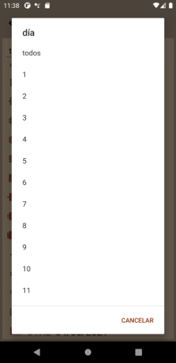
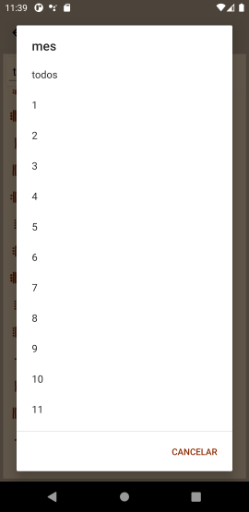
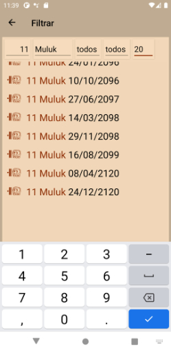

# Installation & Usage

## Installation

Download the latest release: [Release at GitHub](https://github.com/Release-Candidate/Tzolkin/releases/latest)

### Android

Install the package for your smartphone (.apk for Android) onto your phone - search the web on how you can do that, this depends on your phone

### iOS

I can’t generate an iPhone package myself, so you have to build the project IOS for yourself and provision the app to your phone. Microsoft has a how-to [here](https://docs.microsoft.com/en-us/xamarin/ios/get-started/installation/device-provisioning/free-provisioning?tabs=macos)

### NuGet Package

Download an install the Tzolkin Nuget package using your IDE (Visual Studio or JetBrains Rider) or one of the command-line possibilities: [Tzolkin Package at NuGet](https://www.nuget.org/packages/Tzolkin/)

In an interactive F# FSI session, you can use the command #r "nuget: Tzolkin" to download and use the NuGet package LunaZodiaco.

## Usage of the Smartphone App

See [YouTube video of the smartphone app](https://www.youtube.com/watch?v=os32KCEqGCk) for a video.

